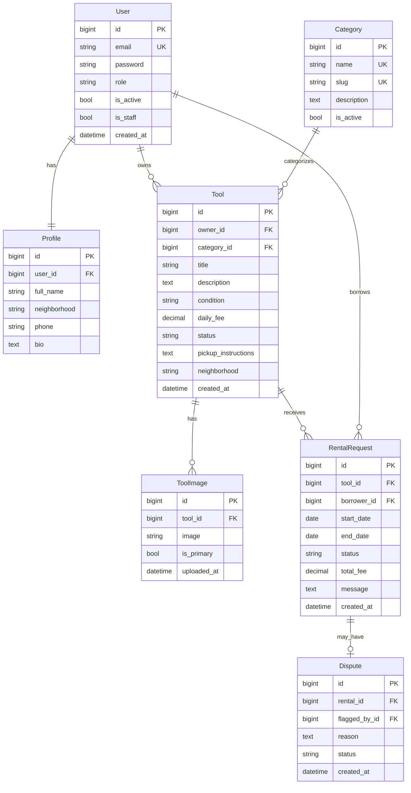

# ToolPool — Database Diagram (ER)

> Paste the Mermaid block into [mermaid.live](https://mermaid.live) to export PNG/SVG for your whiteboard submission.

## Entity Relationship Diagram



## Relationship Summary (plain English)

1. **User ↔ Profile** — One-to-one. Every account has one profile (name, neighborhood).
2. **User → Tool** — One-to-many. A lender can list many tools.
3. **Category → Tool** — One-to-many. Each tool belongs to one category.
4. **Tool → ToolImage** — One-to-many. A tool can have many photos.
5. **Tool → RentalRequest** — One-to-many. Neighbors request a tool for date ranges.
6. **User → RentalRequest** — One-to-many. A borrower can make many requests.
7. **RentalRequest ↔ Dispute** — One-to-one (optional). Admins monitor flagged rentals.

## ASCII sketch

```
┌──────────┐ 1:1 ┌─────────┐
│   User   │─────│ Profile │
└────┬─────┘     └─────────┘
     │ 1
     │ owns
     │ *
┌────┴─────┐ *    1 ┌──────────┐
│   Tool   │────────│ Category │
└────┬─────┘        └──────────┘
     │ 1
     ├──────── * ToolImage
     │
     │ 1
     │ *
┌────┴──────────┐
│ RentalRequest │──── 0..1 Dispute
└───────────────┘
```
